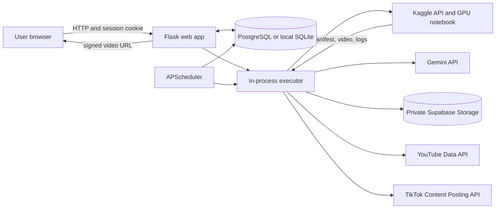
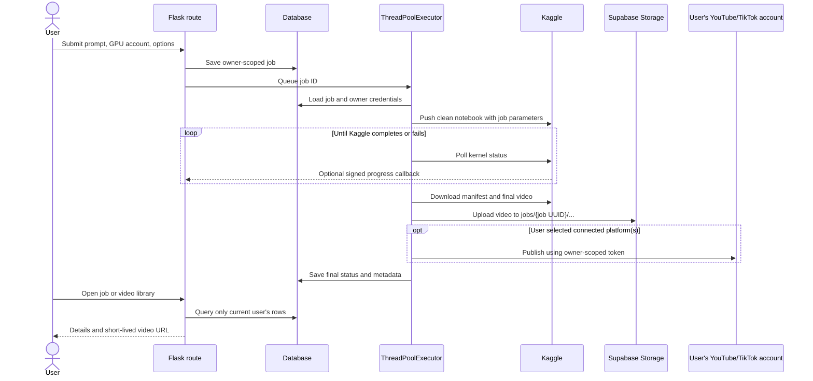
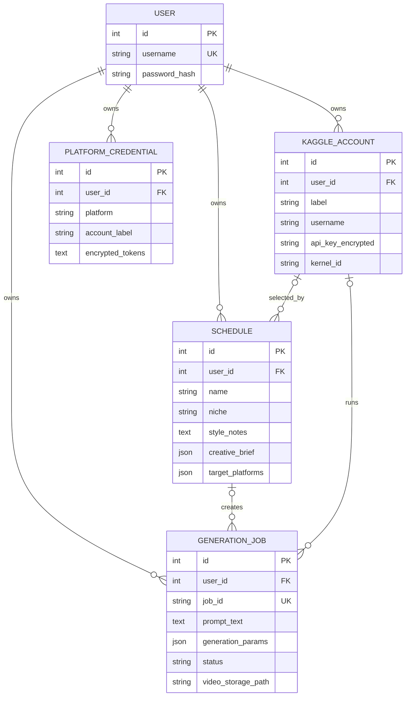

# Architecture

## System overview

The web application stores workspace data and coordinates generation. Kaggle runs the GPU workload in an isolated notebook. The service retrieves the notebook output, stores the video, and optionally publishes it through the user's connected platform accounts.

The app does not proxy all video bytes through Flask when Supabase is configured. It checks ownership, creates a short-lived signed URL, and redirects the browser to private storage.

## Generation lifecycle

Job statuses are `queued`, `pushing`, `running`, `downloading`, `posting`, `completed`, and `failed`. A failed publish can leave a generated video attached to a failed job; retry posting uses that video without rerunning H3. A completed Kaggle run can also retry only its output download.

## Workspace data model

Every browser-facing query for jobs, schedules, Kaggle accounts, and provider credentials filters by `current_user.id`. A job stores both its owner and its selected Kaggle account. Provider clients receive the job owner ID and use it to select Gemini, YouTube, or TikTok credentials. Foreign keys and per-workspace uniqueness constraints back up those checks.

The prompt is stored with its generation job. A schedule stores the reusable niche, style notes, creative brief, timing, and video settings from which it creates future jobs. There is no separate prompt-template library.

## Component responsibilities

| Component | Responsibility |
| --- | --- |
| `app/__init__.py` | Flask application factory, extensions, database configuration, and blueprint registration |
| `app/auth.py` | Signup, login, logout, and Flask-Login user loading |
| `app/routes/` | Authenticated UI and user-scoped data operations |
| `app/models.py` | Database schema and relationships |
| `app/pipeline.py` | Generation, resume, output download, retries, and publishing |
| `app/kaggle_client.py` | Kaggle client setup, parameter file, notebook copy, push, poll, and artifact download |
| `app/scheduler.py` | In-process schedule registration and scheduled job creation |
| `app/storage.py` | Supabase Storage REST operations and signed URLs |
| `app/llm_client.py` | User-keyed Gemini prompting and deterministic fallbacks |
| `app/youtube_client.py`, `app/tiktok_client.py` | User-keyed publishing and token refresh |
| `notebook/*.ipynb` | Kaggle GPU workload source; exactly one `.ipynb` is expected |

## HTTP surface

| Route | Purpose |
| --- | --- |
| `GET/POST /signup`, `GET/POST /login`, `POST /logout` | User authentication |
| `GET /`, `GET/POST /generate` | Owner dashboard and manual job creation |
| `GET /jobs/<id>`, `/api/jobs/<id>` | Job detail and polling API |
| `GET /jobs/<id>/video`, `/download` | Owner-checked video access |
| `GET /videos` | Owner-scoped video library |
| `POST /jobs/<id>/delete-*`, `/retry-*` | Owner-checked job actions |
| `GET/POST /schedules`, `/schedules/<id>` | Owner-scoped recurring schedules |
| `GET/POST /settings` and credential actions | User's Kaggle and provider setup |
| `POST /api/kaggle/progress/<job UUID>` | Notebook callback authenticated by shared callback token |
| `GET /health` | Database connectivity probe |

## Storage and local runtime

The database is the source of truth for owners, prompts, statuses, and manifests. The private Supabase bucket stores durable videos when configured. Temporary notebook copies, parameter JSON, and downloaded outputs are under ignored `runtime/` directories. On ephemeral hosts, those local files disappear on restarts; the database and Supabase bucket persist independently.
