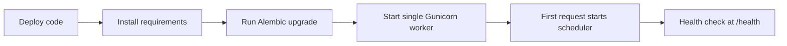

# Deployment guide

## Render and PostgreSQL

The included `render.yaml` defines one Render web service. It installs `requirements.txt`, runs `flask --app run db upgrade`, then starts Gunicorn with one worker and eight threads. Set the unsynchronized values in the Render dashboard: `ADMIN_PASSWORD`, `DATABASE_URL`, `FERNET_KEY`, and Supabase URL/service key. Render generates a Flask secret key and enables secure session cookies in the blueprint. Add the platform application credentials only when users will connect those services.

Use a managed PostgreSQL database and persistent private Supabase Storage for production. Confirm the Render database URL is reachable from the service. The app normalizes `postgres://` and `postgresql://` forms for psycopg2 and requests SSL when the URL has no `sslmode` parameter. Keep the bucket private because the service role key can access stored objects.

## Deployment sequence

Migrations run before Gunicorn starts. The `/health` route checks database connectivity, not Kaggle, Gemini, YouTube, TikTok, or storage access. Confirm those integrations separately with a user workspace configured for them.

## First deployment and migrations

The user-workspace migration creates the initial user using `ADMIN_USERNAME` (default `admin`) and `ADMIN_PASSWORD`. Set those before the first upgrade that introduces users. Existing Kaggle accounts, schedules, jobs, and platform credentials are assigned to that initial user by the migrations. Passwords are hashed in the database. Later environment changes do not change an existing database account password; use an account recovery/reset feature if one is added, or perform a carefully reviewed database operation.

Never solve a failed migration by dropping or clearing a production database. Read the first Alembic/SQL error and inspect the schema and current `alembic_version`. Fix the migration or reconcile the expected existing schema, then redeploy. PostgreSQL DDL is transactional for these migrations, but always inspect the database before retrying. Preserve database and storage backups before schema changes.

## Service topology limits

APScheduler and the `ThreadPoolExecutor` live inside the web process. The blueprint intentionally uses one Gunicorn worker; adding workers or replicas can create duplicate schedulers and duplicate schedule firing. Worker threads also disappear with the process and do not provide durable queue semantics. For reliable multi-instance scheduling and generation, move scheduling and jobs to an external queue/worker architecture before scaling horizontally. A free service may sleep and cannot guarantee scheduled execution.

## Secrets and persistence

Keep production secrets in the hosting provider's environment settings. Back up the PostgreSQL database, private storage objects, and the Fernet key separately. Do not include `.env`, database files, `instance/`, or `runtime/` in source control. Local SQLite and runtime artifacts are ignored by Git; ephemeral service disks can lose runtime artifacts during restarts.
