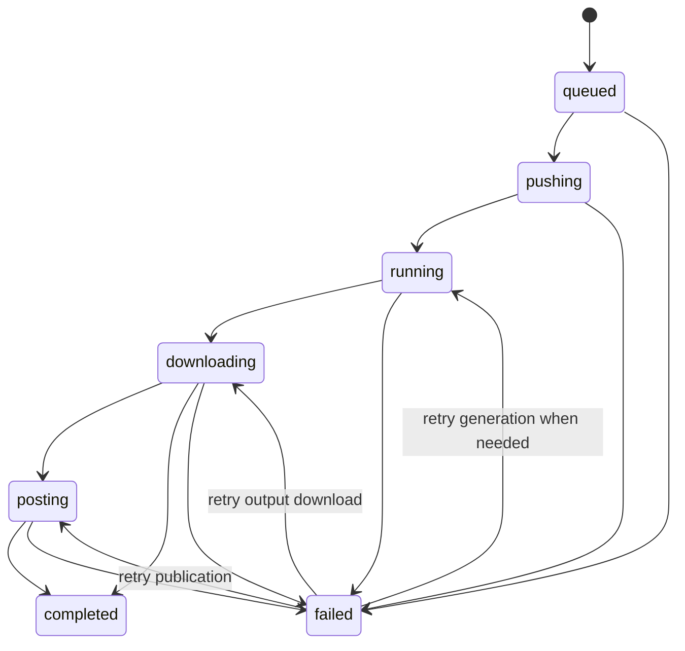

# Operations and recovery

## Job states

The database stores job state and output manifest. Worker execution is in process. On web startup, the scheduler checks in-flight states and submits them for resumption; this is best-effort recovery, not durable queue delivery. Verify Kaggle state and the job log before retrying an operation that may already have completed externally.

## Scheduled jobs

Schedules are registered with APScheduler when the first request initializes the scheduler. Keep one running web process. Multiple processes or replicas can fire the same due schedule more than once because the scheduler has no shared coordination store. Confirm the selected timezone is a valid IANA zone and that the configured Kaggle account remains enabled. Service sleeping or deployment restarts can delay or interrupt work.

## Video storage and cleanup

With all Supabase settings configured, generated files go to the configured private bucket and the database records object paths and metadata. Signed links expire. Without Supabase, the app relies on local runtime paths; ephemeral hosting can remove these files. Deleting app rows does not automatically make old local runtime files disappear in every recovery scenario. Review bucket lifecycle/retention separately and do not remove objects based only on age without checking database references.

## Backup and recovery

Back up PostgreSQL and the private storage bucket. Preserve `FERNET_KEY` with restricted access; database credentials are encrypted with it. A database backup without its key may contain credentials that cannot be used, while a key without the database does not restore workspace state. Test restore procedures on a separate database and bucket before relying on them.

If a deploy fails:

1. Find the first migration or startup exception rather than the final Render exit line.
2. Check `alembic_version` and the actual affected table/constraints against the migration.
3. Keep existing data. Do not clear the database or storage to get a deploy past a migration.
4. Correct the migration or reconcile the schema, deploy, and confirm `/health` plus a real end-to-end job.

The health endpoint only checks database connectivity. Check Kaggle API access, storage permissions, callback reachability, and platform token refresh from application logs and a controlled workspace job.

## Secret rotation

Rotate external app credentials in their provider and hosting dashboard. Keep Flask's session key stable unless you intend to invalidate all sessions. Fernet key rotation requires decrypting and re-encrypting all stored credentials before replacing the old key; simply changing `FERNET_KEY` makes existing tokens unreadable. Do not delete old secret material until a tested migration and backup exist.
